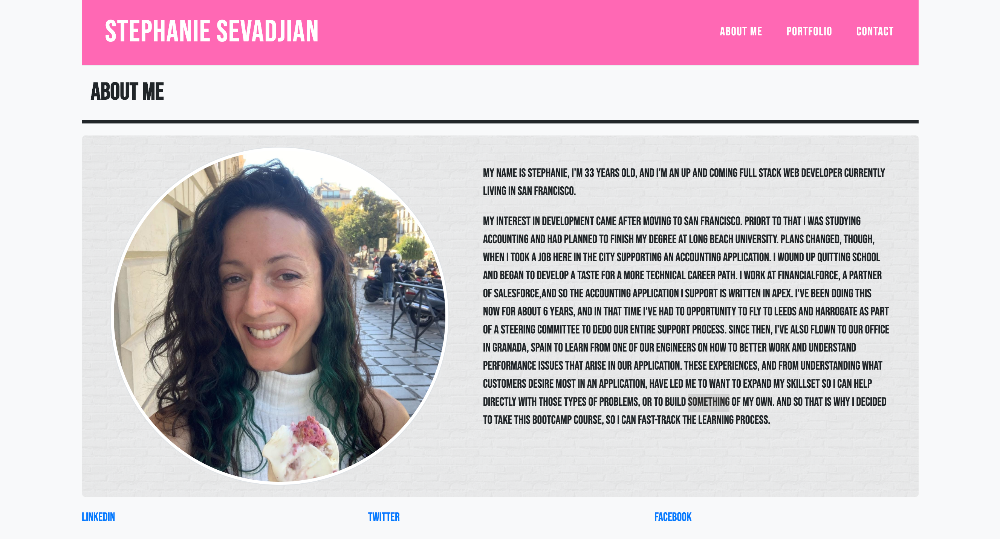

## Homework 2: CSS and Bootstrap Homework Responsive Portfolio
Created a responsive HTML web page using bootstrap framework.

Included a nav bar with links to interrelated pages: index.html (About Me), portfolio.html (Portfolio), and contact.html (Contact).

Includede sticky footer with links to social media accounts.

## Screenshots of Final Product

## Link to Live Github page
https://ssevadjian.github.io/Bootstrap-Playground/index.html

## Link to homework in Github
https://github.com/ssevadjian/Bootstrap-Playground