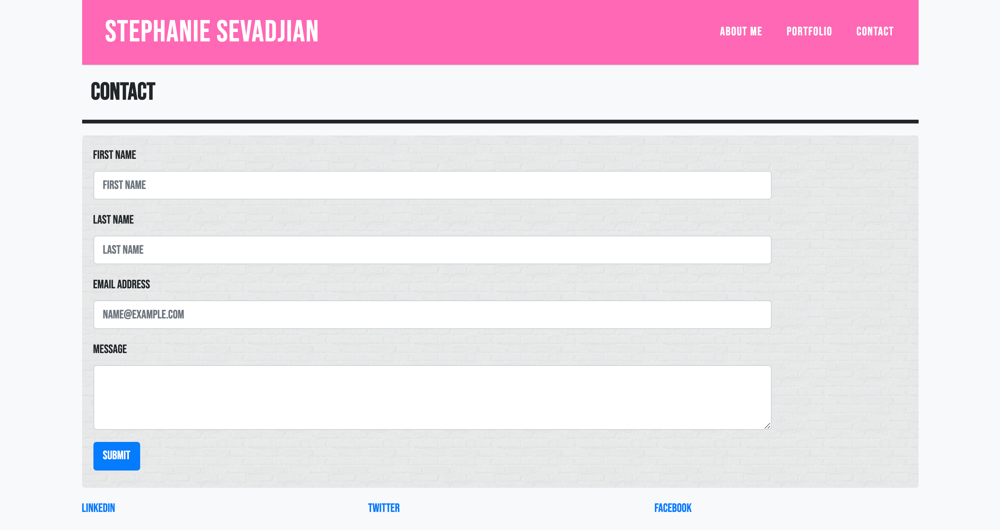

## CSS and Bootstrap Homework Responsive Portfolio:
Created a responsive HTML web page using bootstrap framework.

Included a nav bar with links to interrelated pages: index.html (About Me), portfolio.html (Portfolio), and contact.html (Contact).
 
Included bonus sticky footer with links to social media accounts.

Included personal information such as full name and images (social media links are in the footer), and a little information about how my interest in development came about.

Used semantic HTML elements.

This web page will be used as a base for my real portfolio as I begin to create and develop my own applications and gain more skills to showcase. 

## Screenshots of Final Product

## Link to Live Github page
https://ssevadjian.github.io/CSS-and-Bootstrap-Homework-Responsive-Portfolio/

## Link to homework in Github
https://github.com/ssevadjian/CSS-and-Bootstrap-Homework-Responsive-Portfolio